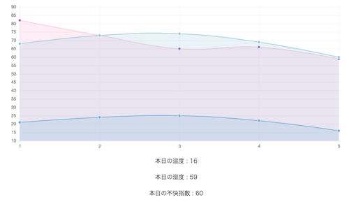

# hukai-shisu-display
####This app display a temperature-humidity index.
* **This source is a education to self.** 

* This app have a two version.
GUI version and CLI version.

* hukai-shisu(不快指数) is a Japanese word. 
This means "temperature-humidity index".

-----
####How to use a GUI version.
* Display a Today's temperature-humidity index. 
And Temperature and humidity also display.

* Display 5 days before up to information.

##### ---DEMO---

[DEMO PAGE on Heroku](https://hukai-shisu-display.herokuapp.com/)

#####---Environment---

* This app use a "Python 3" and Python's framework of "Bottle".

* Graph part use a JavaScript's library of "Chart.js".

####---API---
Weather information get a data of "[Openweathermap](http://openweathermap.org/)".

-------

####How to use a CLI version.
This script need a two arguments, In the order of temperature and humidity.
execute a script then display a temperature-humidity index.

Example：temperature 30℃、humidity 80%

	
	Python 2
	python hukai_shisu_python2.py 30 80
	
	Python 3
	python hukai_shisu_python3.py 30 80
	

